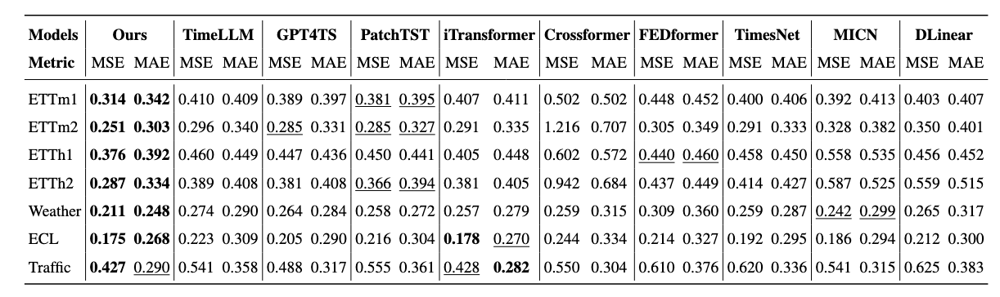
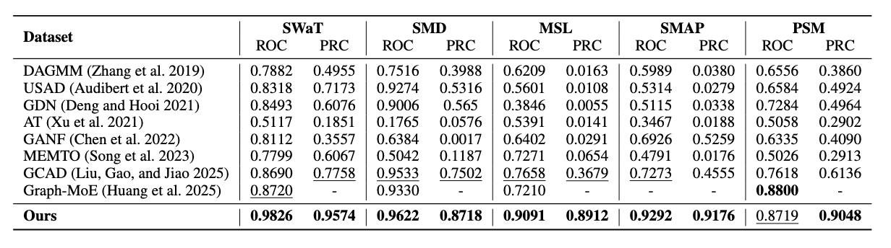

# Cross Alignment of State Space Model and LLMs for Time Series Anomaly Detection

## Abstract
The increasing volume of time series data across domains such as finance, energy, and healthcare has made time series anomaly detection (TSAD) a critical task. However, existing models often rely on a single representation branch, which leads to information loss and incomplete anomaly modeling. Second, while LLMs perform well in textual reasoning and cross-modal tasks, their application to purely numerical time series remains underexplored. Without proper guidance or adjustment, LLMs have difficulty identifying which dimensions or time regions are most relevant to the underlying signal features. To address these challenges, we propose a novel TSAD framework that tightly integrates the semantic reasoning capacity of LLMs with the efficient temporal modeling of state space models (SSMs). First, we introduce Principal Memory Distillation (PMD), a novel mechanism that enables LLMs to dynamically extract and retain principal temporal components most relevant to anomaly detection, enhancing their alignment with time series dynamics. Second, we design a dual time-branch joint enhancement architecture, where a semantic time branch (LLM-based) captures long-range dependencies and contextual reasoning, while a frequency-domain branch (based on Mamba SSM) models periodic and structural patterns. This hybrid design captures complementary features for more accurate and robust anomaly detection. Extensive experiments on five TSAD datasets and seven forecasting benchmarks demonstrate that our method significantly outperforms state-of-the-art baselines in precision, recall, and F1-score, while also exhibiting superior transferability and scalability across domains.

## Architecture


## Results



## Get Start
1. Create new virtual environement with Python 3.10 .
2. Clone the repo.
3. Install the requirements using: ```pip install -r requirements.txt```.
4. Download data.
5. Train and evaluate. using the scripts in ./scripts folder:
```bash
bash ./scripts/SMD.sh
bash ./scripts/MSL.sh
bash ./scripts/SMAP.sh
bash ./scripts/PSM.sh
bash ./scripts/SWAT.sh
bash ./scripts/NIPS_TS_Swan.sh
bash ./scripts/NIPS_TS_Water.sh
```
